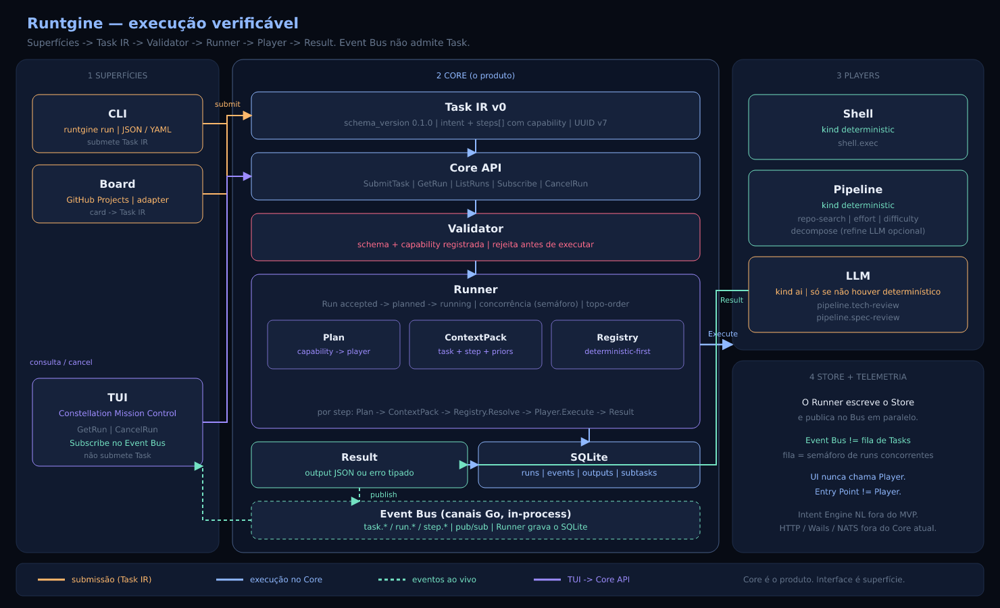

<p align="center">
  
</p>

<h1 align="center">Runtgine</h1>

<p align="center">
  <strong>Um runtime orientado a eventos que transforma intenção estruturada em execução verificável.</strong>
</p>

<p align="center">
  Determinístico quando possível. Inteligente quando necessário.
</p>

<p align="center">
  <a href="https://go.dev/"></a>
  
  
  
  <a href="LICENSE"></a>
</p>

<p align="center">
  <a href="#visão">Visão</a> ·
  <a href="#estágio-do-projeto">Estágio</a> ·
  <a href="#começando">Começando</a> ·
  <a href="#arquitetura">Arquitetura</a> ·
  <a href="#tui">TUI</a> ·
  <a href="#configuração">Configuração</a> ·
  <a href="#contribuindo">Contribuindo</a>
</p>

---

> [!IMPORTANT]
> O Runtgine está em fase **MVP** (sem release estável). O estágio liberável
> em `main` está em [Estágio do projeto](#estágio-do-projeto) — atualizado a
> cada merge de release.

## Visão

O Runtgine é um runtime universal de execução e orquestração, local-first,
protocol-first e event-driven. Ele recebe uma `Task`, valida sua estrutura,
resolve capabilities e coordena `Players` determinísticos, LLMs, serviços ou
humanos através de eventos observáveis.

LLMs são uma capacidade possível — nunca a autoridade central do sistema.

```text
Task → Event → Queue → Player → Result
```

### Princípios

- **Deterministic-first:** regras, ferramentas e código antes de LLMs.
- **Validation-first:** estrutura, dependencies, capabilities e `input_schema`
  são verificados antes do run.
- **Protocol-first:** entradas e saídas têm contratos explícitos e versionados.
- **Event-driven:** o lifecycle do Run gera telemetria observável e persistida.
- **Core is the product:** CLI, TUI e Board são superfícies sobre o mesmo Core.
- **Player, não Agent:** qualquer executor de capability pode participar.

### O que o Runtgine não é

- um framework de agentes ou um chatbot;
- um wrapper específico de provedor LLM;
- um terminal multiplexer;
- uma alternativa ao MCP;
- um sistema em que toda tarefa precisa de IA.

## Estágio do projeto

Visão enxuta do que já está em `main`. **Atualizar esta seção em todo PR
`release/*` → `main`** (e em PRs para `develop` quando o estágio mudar).

**Agora:** MVP funcional completo (slices 1–38; 1.0 magro feito). Primeira release: **v0.1.0-rc.1**.

| | Entrega |
|---|---|
| Feito | Slice 1 — Core, Task IR, Validator, Event Bus, SQLite, Shell Player, CLI |
| Feito | Slice 2 — Pipeline, ContextPack, LLM Players, GitHub Board |
| Feito | Slice 3 — TUI Constellation Mission Control |
| Feito | Slice 4 — Validator com JSON Schema, IDs/`schema_version` estritos, sandbox Shell v0 |
| Feito | Slice 5 — Intent Engine NL v0 (`runtgine intent`) |
| Feito | Slice 6 — Runtime Graph v0 (`runtgine graph snapshot`) |
| Feito | Slice 7 — Graph Hits v0 (`graph_hits` / `QueryHits`) |
| Feito | Slice 8 — Git Player v0 (`git.status` / `diff` / `log` / `add` / `commit`) |
| Feito | Slice 9 — Filesystem Player v0 (`fs.read` / `write` / `list` / `stat`) |
| Feito | Slice 10 — Execution Policy + HITL v0 (`approve` / `deny` / `waiting_approval`) |
| Feito | Slice 11 — Docker Player v0 (`docker.ps` / `inspect` / `logs` / `run` / `build`) |
| Feito | Slice 12 — Resource Claims v0 (`24`, G-93..G-98; `claim.conflict`) |
| Feito | Slice 13 — Blast Radius v0 (`25`, G-99..G-104; `runtgine blast`) |
| Feito | Slice 14 — TUI GRAPH v0 (`26`, G-105..G-110; aba GRAPH) |
| Feito | Slice 15 — Walk Blast←Graph v0 (`27`, G-111..G-116; `affected`) |
| Feito | Slice 16 — HTTP Player v0 (`28`, G-117..G-122; `http.get` / `http.head`) |
| Feito | Slice 17 — Project Memory v0 (`29`, G-123..G-128; `runtgine memory`) |
| Feito | Slice 18 — Test Player v0 (`30`, G-129..G-134; `test.go`) |
| Feito | Slice 19 — Intent → Players (`031`, G-135..G-136; `test.go` / `git.status`) |
| Feito | Slice 20 — Context Engine v0 (`31`, G-137..G-139; semente `repo_hits`) |
| Feito | MVP 1.0 magro (`09`/`031`, G-135..G-140) |
| Feito | Slice 21 — Intent Surface TUI (`32`, G-141..G-146; aba INTENT) |
| Feito | Slices 22–24 — Evolution v0 (`33`, G-147..G-152; Router, Playbooks, Lessons) |
| Feito | Slices 25–26 — HTTP API v0 (`34`, G-153..G-158; `runtgine serve` + webhooks) |
| Feito | Slice 27 — Desktop Wails v3 INTENT/LIVE (`35`, G-159..G-163; `runtgine desktop`) |
| Feito | Slice 28 — demais views desktop + Lessons HITL (`35` G-161/G-165) |
| Feito | Slice 29 — NPM Player v0 (`36`, G-166..G-171; `npm.test`) |
| Feito | Slice 30 — Pytest + Yarn Players v0 (`37`, G-172..G-179) |
| Feito | Slice 31 — Memory Player v0 (`38`, G-180..G-186; read-only) |
| Feito | Slice 32 — MCP Memory Server v0 (`39`, G-187..G-193; `runtgine mcp` + `/mcp`) |
| Feito | Slice 33 — Workflow Templates v0 (`40`, G-194..G-200; `runtgine template`) |
| Feito | Slice 34 — Infra Players v0 (`41`, G-201..G-209; `k8s.*` / `tf.*` / `pg.ping`) |
| Feito | Slice 35 — Helm Player v0 (`42`, G-210..G-216; `helm.lint` / `template` / `list` / `status`) |
| Feito | Slice 36 — Cloud AWS Player v0 (`43`, G-217..G-223; `aws.sts-identity` / `s3-buckets` / `s3-objects`) |
| Feito | Slice 37 — Cloud Players GCP + Azure v0 (`44`, G-224..G-230; `gcp.*` / `azure.*` read-only) |
| Feito | Slice 38 — Postgres EXPLAIN v0 (`45`, G-231..G-237; `pg.explain`; fila G-41 fechada) |
| Feito | Release v0.1.0-rc.1 — primeiro corte do produto (binários multi-OS) |
| Próximo código | Nenhum recorte nomeado restante; NATS (G-36) DEFERRED — release ou nova decisão em `04` |

Detalhe do corte: [`docs/09-mvp.md`](docs/09-mvp.md). Limitações atuais abaixo.

## Começando

### Requisitos

- [Go 1.25 ou superior](https://go.dev/doc/install)
- Git
- Desktop (`runtgine desktop`): no Linux, `libgtk-4-dev` e `libwebkitgtk-6.0-dev` (CGO). Sem CGO o comando existe mas recusa abrir a janela.

### Instalação a partir do código

```bash
git clone https://github.com/gspaim/Runtgine.git
cd Runtgine

go test ./...
go build -o bin/runtgine ./cmd/runtgine
```

Opcionalmente, coloque o binário no seu `PATH`:

```bash
mkdir -p "$HOME/.local/bin"
install -m 0755 bin/runtgine "$HOME/.local/bin/runtgine"
```

### Primeiro run

Execute a Task IR de exemplo:

```bash
./bin/runtgine run examples/hello.json
```

Uma Task mínima:

```json
{
  "schema_version": "0.1.0",
  "source": {
    "entry_point": "cli"
  },
  "intent": {
    "summary": "Executar uma operação determinística"
  },
  "steps": [
    {
      "step_id": "hello",
      "capability": "shell.exec",
      "input": {
        "command": ["echo", "hello-runtgine"],
        "workdir": ".",
        "timeout_ms": 5000
      }
    }
  ]
}
```

O runtime gera IDs UUID v7, valida a Task, cria um Run e persiste o histórico
em:

```text
<workspace>/.runtgine/runtgine.db
```

### Superfícies extras

- TUI: `./bin/runtgine tui` — aba INTENT (preview `Ctrl+p`, submit `Ctrl+Enter`).
- Desktop: `./bin/runtgine desktop` — Wails v3, views INTENT e LIVE (Linux: GTK4 + WebKitGTK 6).
- HTTP API (loopback): `./bin/runtgine serve --listen 127.0.0.1:7420`
- MCP Memory Server (read-only): `./bin/runtgine mcp` (stdio) ou `POST /mcp`
  no serve, com a mesma auth — veja [MCP](docs/39-mcp-memory-v0.md) e
  `examples/mcp-claude-desktop.json`.
- Playbooks de exemplo: copie `examples/playbooks/*.md` para `.runtgine/playbooks/`.
- Lessons HITL: `runtgine lessons list` / `approve` / `reject` (opt-in `lessons.capture=failures`).

## CLI

```text
runtgine run <task.json|task.yaml>  Submete uma Task IR
runtgine intent "<nl>"              Compila NL → Task IR e submete
runtgine status <run_id>            Exibe snapshot e eventos
runtgine cancel <run_id>            Solicita cancelamento de um run
runtgine graph snapshot             Imprime o Runtime Graph (JSON)
runtgine graph refresh              Atualiza players/capabilities do Graph
runtgine memory list|query|record|supersede|archive  Project Memory (JSON)
runtgine blast <task.json|task.yaml> Relatório de impacto + affected (sem executar)
runtgine pipeline run               Executa o pipeline de análise
runtgine board poll                 Importa cards do GitHub
runtgine tui                        Abre a Mission Control
runtgine desktop                    Abre a Mission Control desktop (Wails v3)
runtgine mcp                        MCP Memory Server read-only via stdio
runtgine template list|show|run     Workflow Templates (JSON → Task IR)
```

Exemplos:

```bash
# Git Player
./bin/runtgine run examples/git-status.json

# Filesystem Player
./bin/runtgine run examples/fs-read.json

# HTTP Player (HTTPS GET — hits the network if executed)
./bin/runtgine run examples/http-get.json

# Test Player (go test no workspace; -mod=readonly)
./bin/runtgine run examples/test-go.json

# NPM Player (npm test no workdir com package.json)
./bin/runtgine run examples/npm-test.json

# Linguagem natural → Task IR → execução
./bin/runtgine intent "echo hello-intent"
./bin/runtgine intent "revisar a arquitetura do workspace" --dry-run

# Pipeline determinístico + LLM quando necessário
./bin/runtgine pipeline run \
  --summary "Revisar arquitetura do workspace" \
  --notes "Identificar riscos e decompor o trabalho"

# Consultar um run
./bin/runtgine status <run_id>

# Runtime Graph (memória estrutural do workspace)
./bin/runtgine graph snapshot

# Project Memory (episódios; não é Player)
./bin/runtgine memory record --kind decision --title "Use SQLite for memory"
./bin/runtgine memory query "sqlite"

# Abrir a interface interativa
./bin/runtgine tui
```

Use `runtgine <comando> --help` para consultar todas as flags.

> [!NOTE]
> O cancelamento interrompe a execução quando a chamada compartilha o processo
> do Runner, como na TUI. Uma segunda CLI consegue marcar um run órfão como
> cancelado no SQLite, mas não sinaliza um Runner ativo em outro processo.
> Coordenação multi-processo ainda não faz parte do MVP.

## Arquitetura

<p align="center">
  
</p>

Fluxo real do MVP: **CLI/Board** montam `Task IR` e chamam `SubmitTask`. O **Validator** rejeita schema ou capability desconhecida. O **Runner** cria a `Run`, gera o **Plan** (capability → player, deterministic-first), monta o **ContextPack** por step e chama `Player.Execute`. O **Result** volta ao Runner, que grava o **SQLite** e publica no **Event Bus**. A **TUI** observa e cancela — não submete Task. O Bus não é fila de admissão.

### Modelo central

| Conceito | Responsabilidade |
|---|---|
| `Task` | Intenção estruturada e lista de steps |
| `Plan` | Capability → Player para esta Run |
| `ContextPack` | Contexto montado por step antes do `Execute` |
| `Capability` | O que o runtime roteia; não o nome do Player |
| `Event` | Fato imutável emitido durante o lifecycle |
| `Event Bus` | Pub/sub in-process para quem observa a Run |
| `Queue` | Semáforo de concorrência no Runner (`maxConcurrentRuns`) |
| `Player` | Executor que declara capabilities em um manifest |
| `Result` | Saída estruturada ou erro tipado |
| `Run` | Instância observável da execução de uma Task |
| `Runtime Graph` | Memória estrutural (nós/arestas no SQLite; CLI `graph snapshot`) |

### Estrutura do repositório

```text
cmd/runtgine/             binário e CLI
internal/config/          defaults, arquivo, env e flags
internal/core/            Task, Event, Runner, Registry, Store, Graph e APIs
internal/players/         Shell, Git, Filesystem, HTTP, Test, Pipeline, LLM; NPM = spec `36`
internal/entrypoint/      CLI, Board, TUI, HTTP API e Desktop
examples/                 exemplos de Task IR
docs/                     decisões e especificações oficiais
openspec/                 mudanças OpenSpec (`changes/<NNN>-<slug>/`)
```

## Pipeline

O cenário vertical do MVP analisa trabalho vindo da CLI ou do GitHub Board:

```text
tech-review → spec-review → repo-search → effort → difficulty → decompose
```

`repo-search`, `effort` e `difficulty` priorizam implementação determinística.
Reviews técnicas e de especificação podem usar um backend LLM. Sem credenciais,
o runtime usa um completer heurístico para desenvolvimento e testes locais.

## TUI

A TUI **Constellation Mission Control** usa Bubble Tea, Lip Gloss e Bubbles:

- `RUNS` — histórico, status, intenção e duração;
- `LIVE` — trajetória dos steps, progresso, Player e ContextPack;
- `BOARD` — runs originados do GitHub em Intake, In Flight e Landed;
- `EVENTS` — telemetria, filtro e payload JSON;
- `GRAPH` — snapshot do Runtime Graph (nós/arestas, detalhe, filtro);
- `CONFIG` — configuração efetiva read-only, com secrets mascarados.

Atalhos principais:

| Tecla | Ação |
|---|---|
| `tab` / `shift+tab` | Próxima/aba anterior |
| `j` / `k` ou setas | Navegar |
| `enter` | Inspecionar run |
| `c` | Solicitar cancelamento com confirmação |
| `/` | Filtrar eventos ou nós GRAPH |
| `r` | Atualizar (em GRAPH: `RefreshGraph` + snapshot) |
| `q` | Sair |

A interface adapta-se a terminais largos, médios e estreitos, respeita
`NO_COLOR` e oferece fallback ASCII com `RUNTGINE_ASCII=1`.

## GitHub Board

Defina um token e importe Issues:

```bash
export GITHUB_TOKEN="github_pat_..."

./bin/runtgine board poll \
  --repo owner/repository \
  --label runtgine
```

Ou consulte um GitHub Project v2:

```bash
./bin/runtgine board poll \
  --project-owner owner \
  --project 1 \
  --org
```

O MVP realiza polling e write-back de status/comentário. Ele não cria cards
filhos para subtasks.

## Configuração

Precedência implementada no MVP:

```text
config do runtime: defaults < .runtgine/config.json < variáveis de ambiente
workspace: diretório atual < RUNTGINE_WORKSPACE < --workspace
log: RUNTGINE_LOG_LEVEL < --verbose
```

O `workspace_root` dentro de `config.json` é ignorado; o arquivo é carregado a
partir do workspace já selecionado.

| Variável | Finalidade |
|---|---|
| `RUNTGINE_WORKSPACE` | Workspace raiz |
| `RUNTGINE_LOG_LEVEL` | Nível de log |
| `RUNTGINE_MAX_CONCURRENT_RUNS` | Limite de runs simultâneos |
| `RUNTGINE_LLM_BACKEND` | `openai-compat` ou `anthropic` |
| `RUNTGINE_LLM_API_KEY` / `OPENAI_API_KEY` | Credencial OpenAI-compatible |
| `RUNTGINE_LLM_BASE_URL` | Endpoint OpenAI-compatible |
| `RUNTGINE_LLM_MODEL` | Modelo OpenAI-compatible |
| `RUNTGINE_ANTHROPIC_API_KEY` / `ANTHROPIC_API_KEY` | Credencial Anthropic |
| `RUNTGINE_ANTHROPIC_MODEL` | Modelo Anthropic |
| `RUNTGINE_GITHUB_TOKEN` / `GITHUB_TOKEN` | Credencial GitHub |
| `RUNTGINE_MEMORY_CAPTURE` | `off` (default) ou `failures` |
| `NO_COLOR` | Desabilita cores na TUI |
| `RUNTGINE_ASCII` | Força glifos ASCII na TUI |

Secrets são aceitos somente por variáveis de ambiente e nunca aparecem no
snapshot público de configuração da TUI.

## Segurança

> [!WARNING]
> O Shell Player executa programas locais com os privilégios do processo do
> Runtgine. O MVP evita shell implícito, usa `argv`, aplica timeout, resolve
> symlinks no `workdir` e, quando `input.env` é omitido, herda apenas um
> ambiente mínimo (sem tokens/`RUNTGINE_*`). **Ainda não é um sandbox de
> isolamento forte** (sem namespaces, Landlock ou deny de rede). Não execute
> Tasks não confiáveis.

Consulte a [política de segurança](SECURITY.md) antes de relatar uma
vulnerabilidade.

## Limitações conhecidas

- steps de um mesmo Run são sequenciais; a concorrência atual ocorre entre
  Runs;
- cancelamento não é coordenado entre processos independentes;
- o Shell Player não oferece isolamento de filesystem, rede ou secrets além da
  herança mínima de env e do confinamento de `workdir`;
- não há garantia de estabilidade de API antes da primeira release.

## Documentação

| Documento | Conteúdo |
|---|---|
| [Visão](docs/01-visao.md) | Propósito e fronteiras |
| [Conceitos](docs/02-conceitos.md) | Vocabulário do domínio |
| [Princípios](docs/03-principios.md) | Regras arquiteturais |
| [Decisões](docs/04-decisoes.md) | Fonte de verdade das decisões |
| [MVP](docs/09-mvp.md) | Escopo canônico |
| [Gaps](docs/10-gaps.md) | Lacunas e próximos problemas |
| [Protocolo v0](docs/11-protocolo-v0.md) | Task IR, Manifest, Events e Results |
| [Runtime Graph](docs/18-runtime-graph-v0.md) | Memória estrutural v0 (G-60..G-65) |
| [Graph Hits](docs/19-graph-hits-v0.md) | `graph_hits` / QueryHits (G-66..G-69; slice 7) |
| [Git Player](docs/20-git-player-v0.md) | Player `git.*` v0 (G-70..G-74; slice 8) |
| [Filesystem Player](docs/21-filesystem-player-v0.md) | Player `fs.*` v0 (G-75..G-80; slice 9) |
| [HTTP Player](docs/28-http-player-v0.md) | Player `http.get` / `http.head` v0 (G-117..G-122; slice 16) |
| [Project Memory](docs/29-project-memory-v0.md) | Memória episódica v0 (G-123..G-128; slice 17) |
| [Test Player](docs/30-test-player-v0.md) | Player `test.go` v0 (G-129..G-134; slice 18) |
| [NPM Player](docs/36-npm-player-v0.md) | Player `npm.test` v0 (G-166..G-171; slice 29) |
| [Pytest+Yarn Players](docs/37-pytest-yarn-players-v0.md) | `pytest.run` + `yarn.test` v0 (G-172..G-179; slice 30) |
| [Memory Player](docs/38-memory-player-v0.md) | Player read-only sobre Memory Provider (G-180..G-186; slice 31) |
| [MCP Memory](docs/39-mcp-memory-v0.md) | Servidor MCP read-only (G-187..G-193; slice 32) |
| [Workflow Templates](docs/40-workflow-templates-v0.md) | JSON nativo → Task IR (G-194..G-200; slice 33) |
| [Infra Players](docs/41-infra-players-v0.md) | `k8s.*` / `tf.*` / `pg.ping` (G-201..G-209; slice 34) |
| [Helm Player](docs/42-helm-player-v0.md) | Player `helm.lint` / `template` / `list` / `status` (G-210..G-216; slice 35) |
| [Cloud AWS Player](docs/43-aws-player-v0.md) | Player `aws.sts-identity` / `s3-buckets` / `s3-objects` read-only (G-217..G-223; slice 36) |
| [Cloud GCP + Azure Players](docs/44-cloud-gcp-azure-players-v0.md) | Players `gcp.*` / `azure.*` read-only (G-224..G-230; slice 37) |
| [Postgres EXPLAIN](docs/45-pg-explain-v0.md) | Capability `pg.explain` read-only (G-231..G-237; slice 38) |
| [Context Engine](docs/31-context-engine-v0.md) | Semente `repo_hits` v0 (G-137..G-139; slice 20) |
| [Intent Surface](docs/32-intent-surface-v0.md) | Aba INTENT / Mission Brief (G-141..G-146; slice 21) |
| [Evolution](docs/33-evolution-v0.md) | Router, Playbooks, Lessons (G-147..G-152; slices 22–24) |
| [HTTP API](docs/34-http-api-v0.md) | `runtgine serve` + webhooks (G-153..G-158; slices 25–26) |
| [Desktop Wails](docs/35-wails-v0.md) | `runtgine desktop` (G-159..G-165; slices 27–28) |
| [OpenSpec](openspec/README.md) | Pacotes de mudança `NNN-slug` |
| [TUI Design](docs/14-tui-design.md) | Constellation Mission Control |
| [Git workflow](docs/15-git-workflow.md) | Branches, RC e releases |
| [Intent Engine](docs/17-intent-engine-v0.md) | NL → Task IR v0 |
| [Guia para LLMs](AGENTS.md) | Regras de implementação |

## Contribuindo

Contribuições são bem-vindas (fork + PR ou branch no remoto). Antes de
implementar:

1. leia `AGENTS.md` e os documentos `01` a `06`;
2. verifique se a decisão necessária já está registrada em `docs/04`;
3. para a próxima mudança, use (ou crie) `openspec/changes/<NNN>-<slug>/`
   alinhado à branch `feat/<NNN>-<slug>` — ver [`openspec/README.md`](openspec/README.md);
4. mantenha o Core independente das interfaces;
5. prefira execução determinística a chamadas LLM;
6. parta de `develop` (não de `main`):

```bash
git fetch origin
git checkout develop
git pull
git checkout -b feat/<NNN>-<slug>   # ex.: feat/019-graph-hits
```

7. abra o PR **para `develop`**. A default branch do GitHub é `main`: no
   compare, troque a base para `develop`. Pushes diretos a
   `develop` / `main` / `release/*` são bloqueados; o check `test` precisa
   passar. Ver [fluxo Git](docs/15-git-workflow.md);
8. adicione testes e execute:

```bash
go test ./...
go vet ./...
```

Para mudanças maiores, abra primeiro uma issue descrevendo o problema, o
contrato afetado e os trade-offs.

### Releases

- Integração: `develop`
- Candidates: branch `release/x.y.z` + tags `vX.Y.Z-rc.N`
- Estável: merge em `main` + tag `vX.Y.Z`

Detalhes em [docs/15-git-workflow.md](docs/15-git-workflow.md).

## Licença

Distribuído sob a [licença MIT](LICENSE).

---

<p align="center">
  <strong>Runtgine</strong> — turning intent into verifiable execution.
</p>
