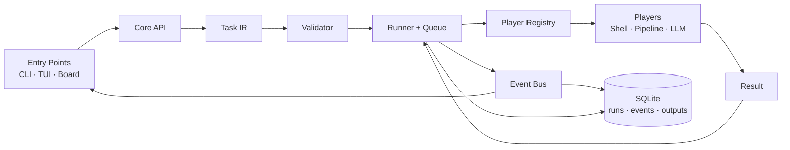

<p align="center">
  
</p>

<h1 align="center">Runtgine</h1>

<p align="center">
  <strong>Um runtime orientado a eventos que transforma intenção estruturada em execução verificável.</strong>
</p>

<p align="center">
  Determinístico quando possível. Inteligente quando necessário.
</p>

<p align="center">
  <a href="https://go.dev/"></a>
  
  
  
  <a href="LICENSE"></a>
</p>

<p align="center">
  <a href="#visão">Visão</a> ·
  <a href="#começando">Começando</a> ·
  <a href="#arquitetura">Arquitetura</a> ·
  <a href="#tui">TUI</a> ·
  <a href="#configuração">Configuração</a> ·
  <a href="#contribuindo">Contribuindo</a>
</p>

---

> [!IMPORTANT]
> O Runtgine está em fase **MVP**. Os três primeiros slices estão funcionais,
> mas ainda não existe uma release estável. APIs e protocolos podem evoluir.

## Visão

O Runtgine é um runtime universal de execução e orquestração, local-first,
protocol-first e event-driven. Ele recebe uma `Task`, valida sua estrutura,
resolve capabilities e coordena `Players` determinísticos, LLMs, serviços ou
humanos através de eventos observáveis.

LLMs são uma capacidade possível — nunca a autoridade central do sistema.

```text
Task → Event → Queue → Player → Result
```

### Princípios

- **Deterministic-first:** regras, ferramentas e código antes de LLMs.
- **Validation-first:** estrutura, dependencies e capabilities são verificadas
  antes do run; validação completa dos schemas de input ainda está no roadmap.
- **Protocol-first:** entradas e saídas têm contratos explícitos e versionados.
- **Event-driven:** o lifecycle do Run gera telemetria observável e persistida.
- **Core is the product:** CLI, TUI e Board são superfícies sobre o mesmo Core.
- **Player, não Agent:** qualquer executor de capability pode participar.

### O que o Runtgine não é

- um framework de agentes ou um chatbot;
- um wrapper específico de provedor LLM;
- um terminal multiplexer;
- uma alternativa ao MCP;
- um sistema em que toda tarefa precisa de IA.

## Estado atual

| Slice | Entrega | Estado |
|---|---|:---:|
| 1 | Core, Task IR, Validator, Event Bus, SQLite, Shell Player e CLI | ✅ |
| 2 | Pipeline, ContextPack, LLM Players e adapter para GitHub Board | ✅ |
| 3 | TUI **Constellation Mission Control** | ✅ |

Funcionalidades disponíveis:

- Task IR v0 em JSON, IDs UUID v7 gerados pelo runtime e dependências entre
  steps;
- validação estrutural e ordenação topológica antes da execução;
- Registry e roteamento de capabilities para Players;
- runs concorrentes, steps sequenciais, timeout, cancelamento e retry por step;
- persistência local de runs, eventos, outputs e subtasks em SQLite;
- Shell Player com comandos em `argv`, timeout e verificação lexical de
  `workdir` dentro do workspace;
- LLM Players com backends OpenAI-compatible e Anthropic;
- pipeline de análise em seis etapas, com fallback heurístico offline;
- ingestão e write-back básico de GitHub Issues/Projects;
- CLI e TUI responsiva com streaming de eventos.

## Começando

### Requisitos

- [Go 1.25 ou superior](https://go.dev/doc/install)
- Git

### Instalação a partir do código

```bash
git clone https://github.com/gspaim/Runtgine.git
cd Runtgine

go test ./...
go build -o bin/runtgine ./cmd/runtgine
```

Opcionalmente, coloque o binário no seu `PATH`:

```bash
mkdir -p "$HOME/.local/bin"
install -m 0755 bin/runtgine "$HOME/.local/bin/runtgine"
```

### Primeiro run

Execute a Task IR de exemplo:

```bash
./bin/runtgine run examples/hello.json
```

Uma Task mínima:

```json
{
  "schema_version": "0.1.0",
  "source": {
    "entry_point": "cli"
  },
  "intent": {
    "summary": "Executar uma operação determinística"
  },
  "steps": [
    {
      "step_id": "hello",
      "capability": "shell.exec",
      "input": {
        "command": ["echo", "hello-runtgine"],
        "workdir": ".",
        "timeout_ms": 5000
      }
    }
  ]
}
```

O runtime gera IDs UUID v7, valida a Task, cria um Run e persiste o histórico
em:

```text
<workspace>/.runtgine/runtgine.db
```

## CLI

```text
runtgine run <task.json|task.yaml>  Submete uma Task IR
runtgine status <run_id>            Exibe snapshot e eventos
runtgine cancel <run_id>            Solicita cancelamento de um run
runtgine pipeline run               Executa o pipeline de análise
runtgine board poll                 Importa cards do GitHub
runtgine tui                        Abre a Mission Control
```

Exemplos:

```bash
# Pipeline determinístico + LLM quando necessário
./bin/runtgine pipeline run \
  --summary "Revisar arquitetura do workspace" \
  --notes "Identificar riscos e decompor o trabalho"

# Consultar um run
./bin/runtgine status <run_id>

# Abrir a interface interativa
./bin/runtgine tui
```

Use `runtgine <comando> --help` para consultar todas as flags.

> [!NOTE]
> O cancelamento interrompe a execução quando a chamada compartilha o processo
> do Runner, como na TUI. Uma segunda CLI consegue marcar um run órfão como
> cancelado no SQLite, mas não sinaliza um Runner ativo em outro processo.
> Coordenação multi-processo ainda não faz parte do MVP.

## Arquitetura



### Modelo central

| Conceito | Responsabilidade |
|---|---|
| `Task` | Intenção estruturada e lista de steps |
| `Event` | Fato imutável emitido durante o lifecycle |
| `Queue` | Ordem de admissão e controle de concorrência |
| `Player` | Executor que declara capabilities em um manifest |
| `Result` | Saída estruturada ou erro tipado |
| `Run` | Instância observável da execução de uma Task |

### Estrutura do repositório

```text
cmd/runtgine/             binário e CLI
internal/config/          defaults, arquivo, env e flags
internal/core/            Task, Event, Runner, Registry, Store e APIs
internal/players/         Shell, Pipeline e LLM Players
internal/entrypoint/      CLI, Board e TUI
examples/                 exemplos de Task IR
docs/                     decisões e especificações oficiais
```

## Pipeline

O cenário vertical do MVP analisa trabalho vindo da CLI ou do GitHub Board:

```text
tech-review → spec-review → repo-search → effort → difficulty → decompose
```

`repo-search`, `effort` e `difficulty` priorizam implementação determinística.
Reviews técnicas e de especificação podem usar um backend LLM. Sem credenciais,
o runtime usa um completer heurístico para desenvolvimento e testes locais.

## TUI

A TUI **Constellation Mission Control** usa Bubble Tea, Lip Gloss e Bubbles:

- `RUNS` — histórico, status, intenção e duração;
- `LIVE` — trajetória dos steps, progresso, Player e ContextPack;
- `BOARD` — runs originados do GitHub em Intake, In Flight e Landed;
- `EVENTS` — telemetria, filtro e payload JSON;
- `CONFIG` — configuração efetiva read-only, com secrets mascarados.

Atalhos principais:

| Tecla | Ação |
|---|---|
| `tab` / `shift+tab` | Próxima/aba anterior |
| `j` / `k` ou setas | Navegar |
| `enter` | Inspecionar run |
| `c` | Solicitar cancelamento com confirmação |
| `/` | Filtrar eventos |
| `r` | Atualizar |
| `q` | Sair |

A interface adapta-se a terminais largos, médios e estreitos, respeita
`NO_COLOR` e oferece fallback ASCII com `RUNTGINE_ASCII=1`.

## GitHub Board

Defina um token e importe Issues:

```bash
export GITHUB_TOKEN="github_pat_..."

./bin/runtgine board poll \
  --repo owner/repository \
  --label runtgine
```

Ou consulte um GitHub Project v2:

```bash
./bin/runtgine board poll \
  --project-owner owner \
  --project 1 \
  --org
```

O MVP realiza polling e write-back de status/comentário. Ele não cria cards
filhos para subtasks.

## Configuração

Precedência implementada no MVP:

```text
config do runtime: defaults < .runtgine/config.json < variáveis de ambiente
workspace: diretório atual < RUNTGINE_WORKSPACE < --workspace
log: RUNTGINE_LOG_LEVEL < --verbose
```

O `workspace_root` dentro de `config.json` é ignorado; o arquivo é carregado a
partir do workspace já selecionado.

| Variável | Finalidade |
|---|---|
| `RUNTGINE_WORKSPACE` | Workspace raiz |
| `RUNTGINE_LOG_LEVEL` | Nível de log |
| `RUNTGINE_MAX_CONCURRENT_RUNS` | Limite de runs simultâneos |
| `RUNTGINE_LLM_BACKEND` | `openai-compat` ou `anthropic` |
| `RUNTGINE_LLM_API_KEY` / `OPENAI_API_KEY` | Credencial OpenAI-compatible |
| `RUNTGINE_LLM_BASE_URL` | Endpoint OpenAI-compatible |
| `RUNTGINE_LLM_MODEL` | Modelo OpenAI-compatible |
| `RUNTGINE_ANTHROPIC_API_KEY` / `ANTHROPIC_API_KEY` | Credencial Anthropic |
| `RUNTGINE_ANTHROPIC_MODEL` | Modelo Anthropic |
| `RUNTGINE_GITHUB_TOKEN` / `GITHUB_TOKEN` | Credencial GitHub |
| `NO_COLOR` | Desabilita cores na TUI |
| `RUNTGINE_ASCII` | Força glifos ASCII na TUI |

Secrets são aceitos somente por variáveis de ambiente e nunca aparecem no
snapshot público de configuração da TUI.

## Segurança

> [!WARNING]
> O Shell Player executa programas locais com os privilégios do processo do
> Runtgine. O MVP evita shell implícito, usa `argv`, aplica timeout e verifica
> lexicalmente o `workdir`, mas **não é um sandbox de isolamento forte**.
> Symlinks não são resolvidos por essa verificação. Quando `input.env` é
> omitido, o processo filho herda o ambiente do Runtgine, inclusive eventuais
> tokens. Não execute Tasks não confiáveis.

Consulte a [política de segurança](SECURITY.md) antes de relatar uma
vulnerabilidade.

## Limitações conhecidas

- validação de JSON Schema dos inputs ainda não é aplicada integralmente pelo
  Validator;
- IDs e `schema_version` fornecidos pelo cliente ainda não são validados de
  forma estrita;
- steps de um mesmo Run são sequenciais; a concorrência atual ocorre entre
  Runs;
- cancelamento não é coordenado entre processos independentes;
- o Shell Player não oferece isolamento de filesystem, rede ou secrets;
- não há garantia de estabilidade de API antes da primeira release.

## Roadmap

Próximas áreas previstas, ainda fora do MVP atual:

- Intent Engine de linguagem natural;
- Runtime Graph completo;
- Context Engine e Router avançados;
- biblioteca maior de Players determinísticos;
- policies, approvals e human-in-the-loop;
- API HTTP e Event Bus distribuído;
- interface desktop Wails + Svelte.

As decisões confirmadas e os gaps estão em
[`docs/04-decisoes.md`](docs/04-decisoes.md) e
[`docs/10-gaps.md`](docs/10-gaps.md).

## Documentação

| Documento | Conteúdo |
|---|---|
| [Visão](docs/01-visao.md) | Propósito e fronteiras |
| [Conceitos](docs/02-conceitos.md) | Vocabulário do domínio |
| [Princípios](docs/03-principios.md) | Regras arquiteturais |
| [Decisões](docs/04-decisoes.md) | Fonte de verdade das decisões |
| [MVP](docs/09-mvp.md) | Escopo canônico |
| [Gaps](docs/10-gaps.md) | Lacunas e próximos problemas |
| [Protocolo v0](docs/11-protocolo-v0.md) | Task IR, Manifest, Events e Results |
| [TUI Design](docs/14-tui-design.md) | Constellation Mission Control |
| [Git workflow](docs/15-git-workflow.md) | Branches, RC e releases |
| [Guia para LLMs](AGENTS.md) | Regras de implementação |

## Contribuindo

Contribuições são bem-vindas. Antes de implementar:

1. leia `AGENTS.md` e os documentos `01` a `06`;
2. verifique se a decisão necessária já está registrada;
3. mantenha o Core independente das interfaces;
4. prefira execução determinística a chamadas LLM;
5. abra a branch a partir de `develop` com o padrão
   `feat/<NNN>-<slug>` (ex.: `feat/001-shell-player`) e abra o PR **para
   `develop`** — ver [fluxo Git](docs/15-git-workflow.md);
6. adicione testes e execute:

```bash
go test ./...
go vet ./...
```

Para mudanças maiores, abra primeiro uma issue descrevendo o problema, o
contrato afetado e os trade-offs.

### Releases

- Integração: `develop`
- Candidates: branch `release/x.y.z` + tags `vX.Y.Z-rc.N`
- Estável: merge em `main` + tag `vX.Y.Z`

Detalhes em [docs/15-git-workflow.md](docs/15-git-workflow.md).

## Licença

Distribuído sob a [licença MIT](LICENSE).

---

<p align="center">
  <strong>Runtgine</strong> — turning intent into verifiable execution.
</p>
